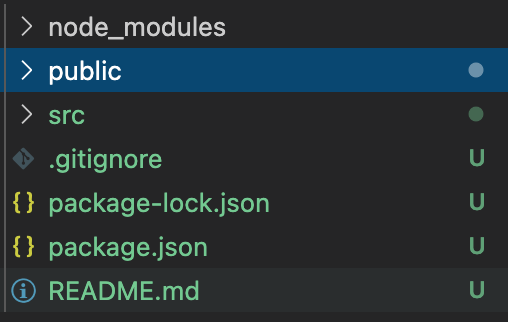

## React
# 1. React Intro  


### 1. What is react?
React is a Javascript library created by Facebook to implement the user interface in front-end. React is not a framework unlike Angular.

### 2. Let's start react!
There are many ways to start React, but we'll use the Create React App here.
You can start React by entering the command in the Terminal as follows.

```
npx create-react-app project-name
```

It will create a live development server, use Webpack to automatically compile React, JSX, and ES6, auto-prefix CSS files, and use ESLint to test and warn about mistakes in the code.  
The web page will pop up when you enter the following command in the project directory:
```
npm start
```

### 3. Project structure
When you create a project with the Create React App, it looks like the image below.

<p float="center">
  
</p>

For a project to be built, you must have two files:  

- public/index.html : the page template
- src/index.js : Javascript entry point

<!-- Let's check public/index.html first. -->


***
#### Keywords
- DOM : 

#### Reference
- https://www.taniarascia.com/introduction-to-the-dom/
- https://create-react-app.dev/docs/folder-structure/