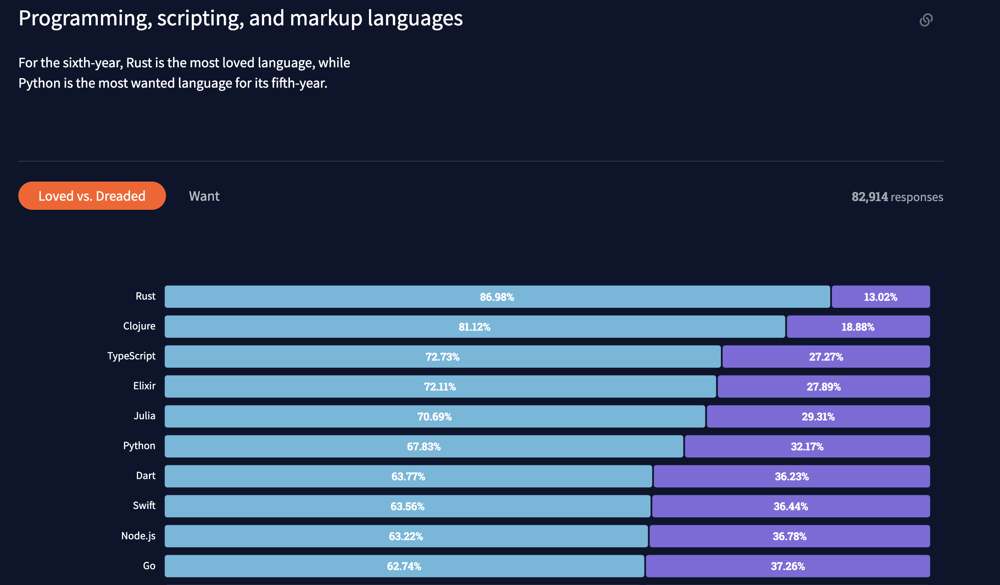

# Rust 개발 일기 Intro
지금 이 글을 쓰기 한참 전의 얘기지만, 새로운 언어를 공부해야겠다고 마음을 먹었었다. 여러 개발서적을 읽으면서 '새로운 프로그래밍 언어를 공부해야 하는 이유'에 대해서 많이 봐왔고, 공감도 했지만, 가장 큰 이유는 새로운 것을 배우고 싶은 마음과, 어디에 얽매히지 않는 개발자가 되고 싶은 마음, 또한 맞는 건지 모르겠지만 회사에서 쓰는 개발스택만 사용하다 보면 나의 능력을 스스로 한정짓는 느낌이 들었기 때문이다.  

## Rust를 공부하는 이유
필자는 스스로 '힙스터기질'이 있다고 생각한다. 일단 남들이 하는 것보다 새로운 것을 먼저 배우고 싶은 마음에 Rust를 공부하기로 마음 먹었다. '힙스터기질'로 Rust를 배운다고 하기에는 Rust는 세계에서 가장 사랑받는 언어지만, 아직까지 국내에서는 Rust가 많이 사용되고 있지는 않은 것 같다. 또 한가지 이유로 Rust라는 언어자체에 대한 만족도가 워낙 높기 때문이다. '많이 쓰이지 않는데 엄청난 가치를 가지고 있다'는 필자가 무언가를 선택할 때 쓰는 가장 중요한 가치다. 사실 Go와 Rust 중 어떤 것을 선택할지 고민을 하긴 했는데, Rust로 할 수 있는 것 중 그동안 겪어 보지 못한 다양한 분야(시스템프로그래밍, 웹어셈블리 등 )를 경험해볼 수 있지 않을까 하여 Rust를 선택하게되었다.  

2021 StackOverflow의 Rust 랭킹

#### 참고
- https://insights.stackoverflow.com/survey/2021#most-loved-dreaded-and-wanted-language-love-dread
- https://stackshare.io/rust